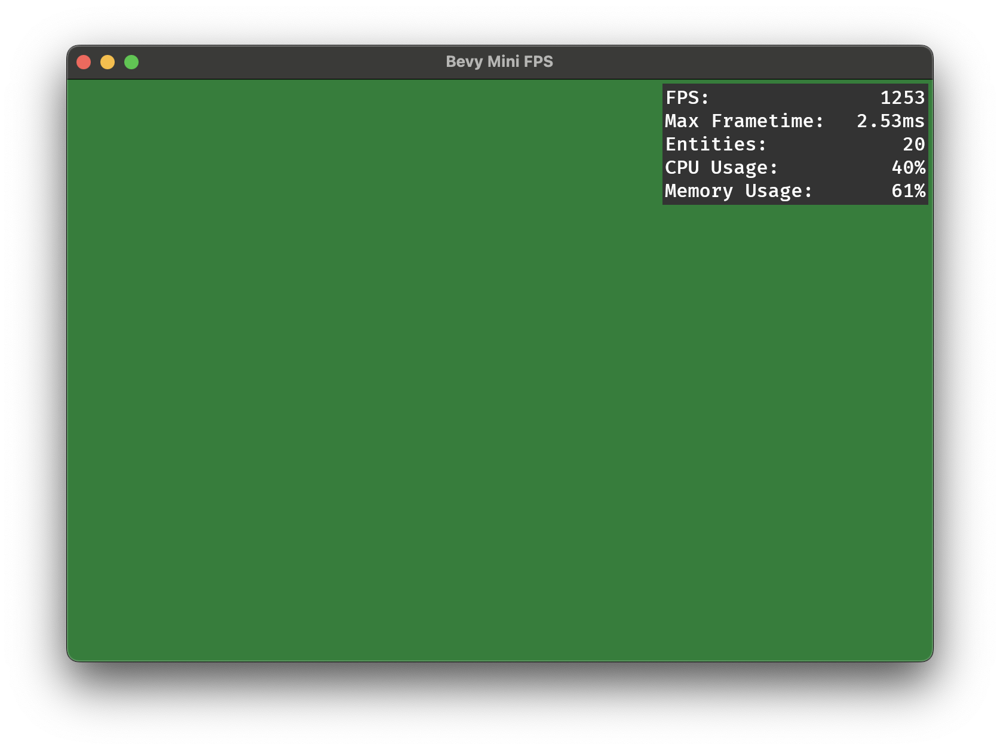

# bevy_quick_fps

Quick and dirty FPS display for bevy.

This crate is a macro that generates some code that displays diagnostic information like the FPS and CPU usage. Unlike normal crates, this crate may continue to work through bevy updates if bevy does not change its API.

## Inspiration

This crate is heavily inspired by the amazing `iyes_perf_ui`.

## Requirements

This crate generates its own diagnostics so no bevy diagnostic plugins is needed,
the only requirement is `bevy_ui`.

## Showcase

## Versions

| bevy        | bevy_quick_fps |
|-------------|----------------|
| 0.15-latest | 0.1            |
